# Gerrit Ecosystem on gerrit.googlesource.com - A Diagrammatic Guide 
> **Disclaimer:**
>
> This document contains my personal notes on the topic,
> compiled from publicly available documentation and various cited sources.
> The materials are intended for educational purposes, personal study, and reference.
> The content is dual-licensed:
> 1. **MIT License:** Applies to all code implementations (Swift, Mermaid, and other programming languages).
> 2. **Creative Commons Attribution 4.0 International License (CC BY 4.0):** Applies to all non-code content, including text, explanations, diagrams, and illustrations.
---

## 1. Gerrit Ecosystem Overview

This mind map provides a high-level categorization of the projects.

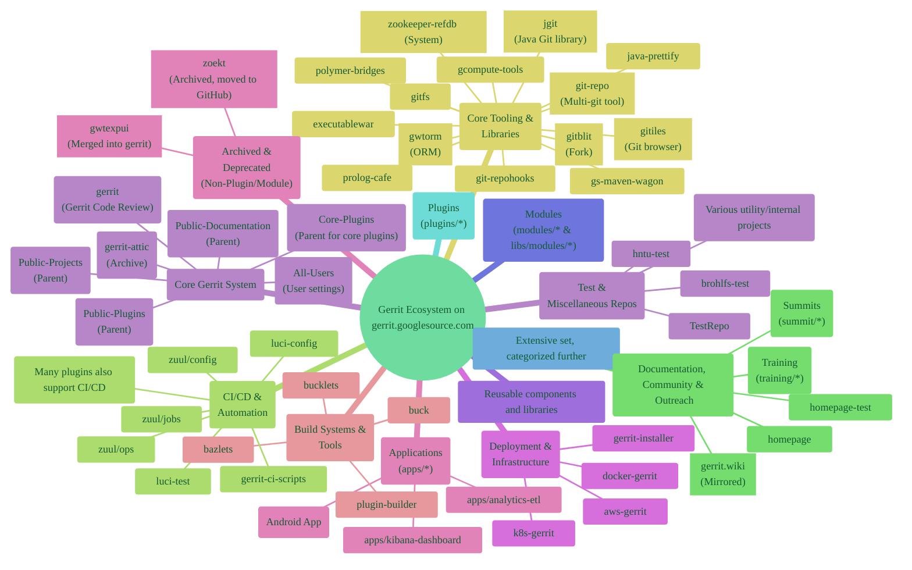

---

## 2. Core Gerrit System Components

This diagram highlights the central Gerrit project and its closely related foundational components.

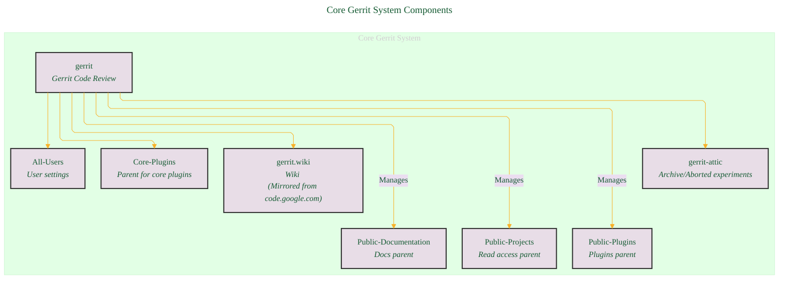

---

## 3. Gerrit Modules

Modules are libraries providing specific functionalities, often used by Gerrit core or plugins.

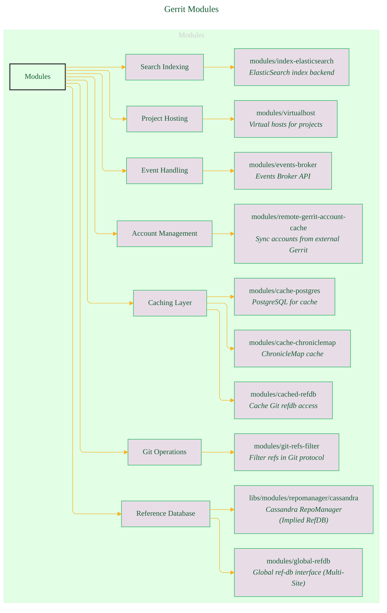

---

## 4. Gerrit Plugin Categories Overview

Plugins extend Gerrit's functionality. This shows the major categories. Detailed plugins will follow.

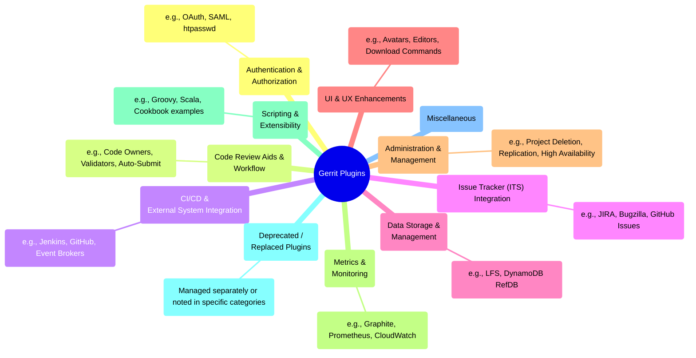

----

## 5. Detailed Plugin Examples by Category

Due to the large number of plugins, here are diagrams for some key categories.

### 5.1. Authentication & Authorization Plugins

```mermaid
---
title: "Authentication & Authorization Plugins"
author: "Cong Le"
version: "1.0"
license(s): "MIT, CC BY 4.0"
copyright: "Copyright (c) 2025 Cong Le. All Rights Reserved."
config:
  layout: elk
  theme: base
---
%%%%%%%% Mermaid version v11.4.1-b.14
%%%%%%%% Available curve styles include the following keywords:
%% basis, bumpX, bumpY, cardinal, catmullRom, linear, monotoneX, monotoneY, natural, step, stepAfter, stepBefore.
%%{
  init: {
    'securityLevel': 'loose',
    'flowchart': { 'htmlLabels': true, 'curve': 'linear' },
    'fontFamily': 'Monaco',
    'themeVariables': {
      'primaryColor': '#F5E3',
      'primaryTextColor': '#145A32',
      'lineColor': '#F8B229',
      'primaryBorderColor': '#27AE60',
      'secondaryColor': '#EBDEF0',
      'secondaryTextColor': '#6C3483',
      'secondaryBorderColor': '#A569BD',
      'fontSize': '15px'
    }
  }
}%%
flowchart TD
    subgraph AuthPlugins["Authentication &<br/> Authorization Plugins"]
        P_AuthRoot["Auth Plugins"]

        P_AuthRoot --> P_htpasswd["plugins/auth-htpasswd<br/><i>Apache htpasswd auth</i>"]
         click P_htpasswd href "https://gerrit.googlesource.com/plugins/auth-htpasswd" "plugins/auth-htpasswd"
        P_AuthRoot --> P_cfoauth["plugins/cfoauth<br/><i>CloudFoundry UAA OAuth2</i>"]
         click P_cfoauth href "https://gerrit.googlesource.com/plugins/cfoauth" "plugins/cfoauth"
        P_AuthRoot --> P_oauth["plugins/oauth<br/><i>Generic OAuth2 Provider</i>"]
         click P_oauth href "https://gerrit.googlesource.com/plugins/oauth" "plugins/oauth"
        P_AuthRoot --> P_saml["plugins/saml<br/><i>SAML Provider Auth</i>"]
         click P_saml href "https://gerrit.googlesource.com/plugins/saml" "plugins/saml"
        P_AuthRoot --> P_gapps_group["plugins/google-apps-group<br/><i>Google Groups backend<br/>(Sample)</i>"]
         click P_gapps_group href "https://gerrit.googlesource.com/plugins/google-apps-group" "plugins/google-apps-group"
        P_AuthRoot --> P_github_groups["plugins/github-groups<br/><i>GitHub Orgs/Teams as Groups</i>"]
         click P_github_groups href "https://gerrit.googlesource.com/plugins/github-groups" "plugins/github-groups"
        P_AuthRoot --> P_singleuser["plugins/singleusergroup<br/><i>Users directly in ACLs</i>"]
         click P_singleuser href "https://gerrit.googlesource.com/plugins/singleusergroup" "plugins/singleusergroup"
    end

```

### 5.2. CI/CD & External System Integration Plugins

```mermaid
---
title: "CI/CD & External System Integration Plugins"
author: "Cong Le"
version: "1.0"
license(s): "MIT, CC BY 4.0"
copyright: "Copyright (c) 2025 Cong Le. All Rights Reserved."
config:
  layout: elk
  theme: base
---
%%%%%%%% Mermaid version v11.4.1-b.14
%%%%%%%% Available curve styles include the following keywords:
%% basis, bumpX, bumpY, cardinal, catmullRom, linear, monotoneX, monotoneY, natural, step, stepAfter, stepBefore.
%%{
  init: {
    'securityLevel': 'loose',
    'flowchart': { 'htmlLabels': true, 'curve': 'linear' },
    'fontFamily': 'Monaco',
    'themeVariables': {
      'primaryColor': '#F5E3',
      'primaryTextColor': '#145A32',
      'lineColor': '#F8B229',
      'primaryBorderColor': '#27AE60',
      'secondaryColor': '#EBDEF0',
      'secondaryTextColor': '#6C3483',
      'secondaryBorderColor': '#A569BD',
      'fontSize': '15px'
    }
  }
}%%
flowchart TD
    subgraph CICDPlugins["CI/CD & External System Integration Plugins"]
    direction LR
        P_CICDRoot["CI/CD &<br/> Integration"]

        P_CICDRoot --> P_Checks["plugins/checks<br/><i>CI System Integration API/UI</i>"]
         click P_Checks href "https://gerrit.googlesource.com/plugins/checks" "plugins/checks"
        P_Checks --> P_ChecksJenkins["plugins/checks-jenkins<br/><i>Jenkins integration for Checks</i>"]
         click P_ChecksJenkins href "https://gerrit.googlesource.com/plugins/checks-jenkins" "plugins/checks-jenkins"

        P_CICDRoot --> EventBrokers["Event Publishing"]
            EventBrokers --> P_ExtEvents["plugins/events<br/><i>Extended Stream Events API</i>"]
             click P_ExtEvents href "https://gerrit.googlesource.com/plugins/events" "plugins/events"
            EventBrokers --> P_EventsKinesis["plugins/events-aws-kinesis<br/><i>AWS Kinesis Broker</i>"]
             click P_EventsKinesis href "https://gerrit.googlesource.com/plugins/events-aws-kinesis" "plugins/events-aws-kinesis"
            EventBrokers --> P_EventsEiffel["plugins/events-eiffel<br/><i>Eiffel Events</i>"]
             click P_EventsEiffel href "https://gerrit.googlesource.com/plugins/events-eiffel" "plugins/events-eiffel"
            EventBrokers --> P_EventsGCloud["plugins/events-gcloud-pubsub<br/><i>GCloud PubSub Broker</i>"]
             click P_EventsGCloud href "https://gerrit.googlesource.com/plugins/events-gcloud-pubsub" "plugins/events-gcloud-pubsub"
            EventBrokers --> P_EventsKafka["plugins/events-kafka<br/><i>Apache Kafka Broker</i><br/>(Replaces plugins/kafka-events)"]
             click P_EventsKafka href "https://gerrit.googlesource.com/plugins/events-kafka" "plugins/events-kafka"
            EventBrokers --> P_EventsLog["plugins/events-log<br/><i>Store events in DB</i>"]
             click P_EventsLog href "https://gerrit.googlesource.com/plugins/events-log" "plugins/events-log"
            EventBrokers --> P_EventsNATS[plugins/events-nats<br/><i>NATS Broker</i>]
             click P_EventsNATS href "https://gerrit.googlesource.com/plugins/events-nats" "plugins/events-nats"
            EventBrokers --> P_EventsRabbitMQ["plugins/events-rabbitmq<br/><i>RabbitMQ Broker</i><br/>(Replaces plugins/rabbitmq)"]
             click P_EventsRabbitMQ href "https://gerrit.googlesource.com/plugins/events-rabbitmq" "plugins/events-rabbitmq"

        P_CICDRoot --> GitHub["GitHub Integration"]
            GitHub --> P_GitHubFull["plugins/github<br/><i>Full GitHub Integration (Replication, PRs)</i>"]
             click P_GitHubFull href "https://gerrit.googlesource.com/plugins/github" "plugins/github"
            GitHub --> P_GitHubPR["plugins/github-pullrequest<br/><i>Import PRs</i>"]
             click P_GitHubPR href "https://gerrit.googlesource.com/plugins/github-pullrequest" "plugins/github-pullrequest"
            GitHub --> P_GitHubRepl["plugins/github-replication<br/><i>Replication Wizard</i>"]
             click P_GitHubRepl href "https://gerrit.googlesource.com/plugins/github-replication" "plugins/github-replication"
            GitHub --> P_GitHubHooks["plugins/github-webhooks<br/><i>Expose Gerrit actions as GitHub hooks</i>"]
             click P_GitHubHooks href "https://gerrit.googlesource.com/plugins/github-webhooks" "plugins/github-webhooks"

        P_CICDRoot --> GenericHooks["Generic Hooks/Webhooks"]
            GenericHooks --> P_Hooks["plugins/hooks<br/><i>Server-side hooks</i>"]
             click P_Hooks href "https://gerrit.googlesource.com/plugins/hooks" "plugins/hooks"
            GenericHooks --> P_HooksAudit["plugins/hooks-audit<br/><i>Audit activity to external log</i>"]
             click P_HooksAudit href "https://gerrit.googlesource.com/plugins/hooks-audit" "plugins/hooks-audit"
            GenericHooks --> P_Webhooks["plugins/webhooks<br/><i>Propagate events to HTTP endpoints</i>"]
             click P_Webhooks href "https://gerrit.googlesource.com/plugins/webhooks" "plugins/webhooks"

        P_CICDRoot --> Zuul["Zuul CI Integration"]
            Zuul --> P_ZuulCore["plugins/zuul<br/><i>Gerrit Zuul Plugin</i>"]
             click P_ZuulCore href "https://gerrit.googlesource.com/plugins/zuul" "plugins/zuul"
            Zuul --> P_ZuulSummary["plugins/zuul-results-summary<br/><i>Zuul results summary tab</i>"]
             click P_ZuulSummary href "https://gerrit.googlesource.com/plugins/zuul-results-summary" "plugins/zuul-results-summary"
            Zuul --> P_ZuulStatus["plugins/zuul-status<br/><i>Zuul status on PolyGerrit</i>"]
             click P_ZuulStatus href "https://gerrit.googlesource.com/plugins/zuul-status" "plugins/zuul-status"

        P_CICDRoot --> P_Task["plugins/task<br/><i>Manage tasks on changes (CI focus)</i>"]
         click P_Task href "https://gerrit.googlesource.com/plugins/task" "plugins/task"
        P_CICDRoot --> P_CloudNotify["plugins/cloud-notifications<br/><i>Firebase Cloud Messaging</i>"]
         click P_CloudNotify href "https://gerrit.googlesource.com/plugins/cloud-notifications" "plugins/cloud-notifications"
    end

```

### 5.3. Issue Tracker (ITS) Integration Plugins

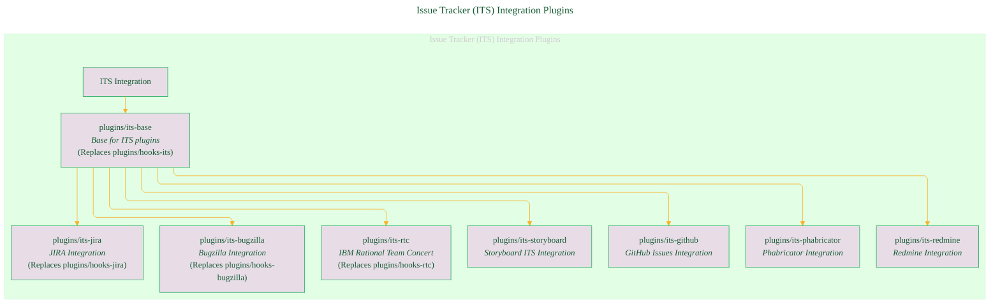

### 5.4. UI & UX Enhancement Plugins

```mermaid
---
title: "UI & UX Enhancement Plugins"
author: "Cong Le"
version: "1.0"
license(s): "MIT, CC BY 4.0"
copyright: "Copyright (c) 2025 Cong Le. All Rights Reserved."
config:
  layout: elk
  theme: base
---
%%%%%%%% Mermaid version v11.4.1-b.14
%%%%%%%% Available curve styles include the following keywords:
%% basis, bumpX, bumpY, cardinal, catmullRom, linear, monotoneX, monotoneY, natural, step, stepAfter, stepBefore.
%%{
  init: {
    'securityLevel': 'loose',
    'flowchart': { 'htmlLabels': true, 'curve': 'linear' },
    'fontFamily': 'Monaco',
    'themeVariables': {
      'primaryColor': '#F5E3',
      'primaryTextColor': '#145A32',
      'lineColor': '#F8B229',
      'primaryBorderColor': '#27AE60',
      'secondaryColor': '#EBDEF0',
      'secondaryTextColor': '#6C3483',
      'secondaryBorderColor': '#A569BD',
      'fontSize': '15px'
    }
  }
}%%
flowchart TD
    subgraph UIUXPlugins["UI & UX Enhancement Plugins"]
    direction LR
        P_UIUXRoot["UI/UX Plugins"]

        P_UIUXRoot --> Avatars["Avatars"]
            Avatars --> P_AvatarsExt["plugins/avatars-external<br/><i>Custom URL for avatars</i><br/>(Replaces plugins/avatars/external)"]
             click P_AvatarsExt href "https://gerrit.googlesource.com/plugins/avatars-external" "plugins/avatars-external"
            Avatars --> P_AvatarsGrav["plugins/avatars-gravatar<br/><i>Gravatar icons</i><br/>(Replaces plugins/avatars/gravatar)"]
             click P_AvatarsGrav href "https://gerrit.googlesource.com/plugins/avatars-gravatar" "plugins/avatars-gravatar"

        P_UIUXRoot --> Editors["Editors &<br/> Viewers"]
            Editors --> P_CodeMirror["plugins/codemirror-editor<br/><i>CodeMirror editor for PolyGerrit</i>"]
             click P_CodeMirror href "https://gerrit.googlesource.com/plugins/codemirror-editor" "plugins/codemirror-editor"
            Editors --> P_BranchNetwork["plugins/branch-network<br/><i>Git branch network view</i>"]
             click P_BranchNetwork href "https://gerrit.googlesource.com/plugins/branch-network" "plugins/branch-network"
            Editors --> P_GitilesPlugin["plugins/gitiles<br/><i>Gitiles browser plugin</i>"]
             click P_GitilesPlugin href "https://gerrit.googlesource.com/plugins/gitiles" "plugins/gitiles"
            Editors --> P_ImageDiff["plugins/image-diff<br/><i>Enhanced image diff</i>"]
             click P_ImageDiff href "https://gerrit.googlesource.com/plugins/image-diff" "plugins/image-diff"
            Editors --> P_XDocs["plugins/x-docs<br/><i>Serve Markdown project docs as HTML</i>"]
             click P_XDocs href "https://gerrit.googlesource.com/plugins/x-docs" "plugins/x-docs"

        P_UIUXRoot --> CommandsUI["Commands &<br/> Actions UI"]
            CommandsUI --> P_DownloadCmd["plugins/download-commands<br/><i>Standard download schemes</i>"]
             click P_DownloadCmd href "https://gerrit.googlesource.com/plugins/download-commands" "plugins/download-commands"
            CommandsUI --> P_ProjDownloadCmd["plugins/project-download-commands<br/><i>Project-specific download commands</i>"]
             click P_ProjDownloadCmd href "https://gerrit.googlesource.com/plugins/project-download-commands" "plugins/project-download-commands"
            CommandsUI --> P_HideActions["plugins/hide-actions<br/><i>Hide UI actions by config</i>"]
             click P_HideActions href "https://gerrit.googlesource.com/plugins/hide-actions" "plugins/hide-actions"
            CommandsUI --> P_Egit["plugins/egit<br/><i>EGit integration extensions (DEPRECATED)</i>"]
             click P_Egit href "https://gerrit.googlesource.com/plugins/egit" "plugins/egit"

        P_UIUXRoot --> InfoDisplay["Information Display"]
            InfoDisplay --> P_ChangeMsg["plugins/changemessage<br/><i>Static info message on change screen</i>"]
             click P_ChangeMsg href "https://gerrit.googlesource.com/plugins/changemessage" "plugins/changemessage"
            InfoDisplay --> P_Emoticons["plugins/emoticons<br/><i>Emoticons in comments</i>"]
             click P_Emoticons href "https://gerrit.googlesource.com/plugins/emoticons" "plugins/emoticons"
            InfoDisplay --> P_LabelUI["plugins/labelui<br/><i>Custom label display control</i>"]
             click P_LabelUI href "https://gerrit.googlesource.com/plugins/labelui" "plugins/labelui"
            InfoDisplay --> P_MOTD["plugins/motd<br/><i>Message on fetch/pull/clone</i>"]
             click P_MOTD href "https://gerrit.googlesource.com/plugins/motd" "plugins/motd"
            InfoDisplay --> P_MsgOfTheDay["plugins/messageoftheday<br/><i>Message of the day display</i>"]
             click P_MsgOfTheDay href "https://gerrit.googlesource.com/plugins/messageoftheday" "plugins/messageoftheday"

        P_UIUXRoot --> P_Donation["plugins/donation-button<br/><i>Shawn Pearce Memorial Fund button</i>"]
         click P_Donation href "https://gerrit.googlesource.com/plugins/donation-button" "plugins/donation-button"
        P_UIUXRoot --> P_GoImport["plugins/go-import<br/><i>'go get' support for Gerrit projects</i>"]
         click P_GoImport href "https://gerrit.googlesource.com/plugins/go-import" "plugins/go-import"
        P_UIUXRoot --> P_Imagare["plugins/imagare<br/><i>Image upload and sharing</i>"]
         click P_Imagare href "https://gerrit.googlesource.com/plugins/imagare" "plugins/imagare"
        P_UIUXRoot --> P_LoginRedirect["plugins/login-redirect<br/><i>Redirect anonymous to login</i>"]
         click P_LoginRedirect href "https://gerrit.googlesource.com/plugins/login-redirect" "plugins/login-redirect"
        P_UIUXRoot --> P_MenuExt["plugins/menuextender<br/><i>Admin-configurable menu entries</i>"]
         click P_MenuExt href "https://gerrit.googlesource.com/plugins/menuextender" "plugins/menuextender"
        P_UIUXRoot --> P_OutOfBox["plugins/out-of-the-box<br/><i>Redirect for fresh installs</i>"]
         click P_OutOfBox href "https://gerrit.googlesource.com/plugins/out-of-the-box" "plugins/out-of-the-box"
        P_UIUXRoot --> P_ServerLogView["plugins/server-log-viewer<br/><i>View server logs via web</i>"]
         click P_ServerLogView href "https://gerrit.googlesource.com/plugins/server-log-viewer" "plugins/server-log-viewer"
    end

```

### 5.5. Administration & Management Plugins

```mermaid
---
title: "Administration & Management Plugins"
author: "Cong Le"
version: "1.0"
license(s): "MIT, CC BY 4.0"
copyright: "Copyright (c) 2025 Cong Le. All Rights Reserved."
config:
  layout: elk
  theme: base
---
%%%%%%%% Mermaid version v11.4.1-b.14
%%%%%%%% Available curve styles include the following keywords:
%% basis, bumpX, bumpY, cardinal, catmullRom, linear, monotoneX, monotoneY, natural, step, stepAfter, stepBefore.
%%{
  init: {
    'securityLevel': 'loose',
    'flowchart': { 'htmlLabels': true, 'curve': 'linear' },
    'fontFamily': 'Monaco',
    'themeVariables': {
      'primaryColor': '#F5E3',
      'primaryTextColor': '#145A32',
      'lineColor': '#F8B229',
      'primaryBorderColor': '#27AE60',
      'secondaryColor': '#EBDEF0',
      'secondaryTextColor': '#6C3483',
      'secondaryBorderColor': '#A569BD',
      'fontSize': '15px'
    }
  }
}%%
flowchart TD
    subgraph AdminPlugins["Administration &<br/> Management Plugins"]
    direction LR
        P_AdminRoot["Admin &<br/> Management"]

        P_AdminRoot --> ProjectMgmt["Project Management"]
            ProjectMgmt --> P_DelProj["plugins/delete-project<br/><i>Delete projects via SSH</i>"]
             click P_DelProj href "https://gerrit.googlesource.com/plugins/delete-project" "plugins/delete-project"
            ProjectMgmt --> P_RenameProj["plugins/rename-project<br/><i>Rename projects via SSH</i>"]
             click P_RenameProj href "https://gerrit.googlesource.com/plugins/rename-project" "plugins/rename-project"
            ProjectMgmt --> P_Reparent["plugins/reparent<br/><i>Self-service project reparenting</i>"]
             click P_Reparent href "https://gerrit.googlesource.com/plugins/reparent" "plugins/reparent"
            ProjectMgmt --> P_Importer["plugins/importer<br/><i>Import projects between Gerrits</i>"]
             click P_Importer href "https://gerrit.googlesource.com/plugins/importer" "plugins/importer"
            ProjectMgmt --> P_ProjGrpStruct["plugins/project-group-structure<br/><i>Enforce project group structure</i>"]
             click P_ProjGrpStruct href "https://gerrit.googlesource.com/plugins/project-group-structure" "plugins/project-group-structure"
            ProjectMgmt --> P_Quickstart["plugins/quickstart<br/><i>Quick-start config at init</i>"]
             click P_Quickstart href "https://gerrit.googlesource.com/plugins/quickstart" "plugins/quickstart"

        P_AdminRoot --> ReplicationHA["Replication &<br/> High Availability"]
            ReplicationHA --> P_Replication["plugins/replication<br/><i>Git protocol replication (Push)</i>"]
             click P_Replication href "https://gerrit.googlesource.com/plugins/replication" "plugins/replication"
            ReplicationHA --> P_PullRepl["plugins/pull-replication<br/><i>Git protocol replication (Pull)</i>"]
             click P_PullRepl href "https://gerrit.googlesource.com/plugins/pull-replication" "plugins/pull-replication"
            ReplicationHA --> P_PushPullRepl["plugins/push-pull-replication<br/><i>Push & Pull replication logic</i>"]
             click P_PushPullRepl href "https://gerrit.googlesource.com/plugins/push-pull-replication" "plugins/push-pull-replication"
            ReplicationHA --> P_ReplStatus["plugins/replication-status<br/><i>Display replication status</i>"]
             click P_ReplStatus href "https://gerrit.googlesource.com/plugins/replication-status" "plugins/replication-status"
            ReplicationHA --> P_HighAvail["plugins/high-availability<br/><i>Cache/Index/Event sync for HA</i><br/>(Merges evict-cache, sync-events, sync-index)"]
             click P_HighAvail href "https://gerrit.googlesource.com/plugins/high-availability" "plugins/high-availability"
            ReplicationHA --> P_MultiMaster["plugins/multi-master<br/><i>Multi-master operation support</i>"]
             click P_MultiMaster href "https://gerrit.googlesource.com/plugins/multi-master" "plugins/multi-master"
            ReplicationHA --> P_MultiSite["plugins/multi-site<br/><i>Multi-site support</i>"]
             click P_MultiSite href "https://gerrit.googlesource.com/plugins/multi-site" "plugins/multi-site"

        P_AdminRoot --> ConfigMgmt["Configuration Management"]
            ConfigMgmt --> P_ServerConfig["plugins/server-config<br/><i>Access server config files via API</i>"]
             click P_ServerConfig href "https://gerrit.googlesource.com/plugins/server-config" "plugins/server-config"
            ConfigMgmt --> P_SecureConfig["plugins/secure-config<br/><i>Encrypt secure.config values</i>"]
             click P_SecureConfig href "https://gerrit.googlesource.com/plugins/secure-config" "plugins/secure-config"
            ConfigMgmt --> P_LogLevel["plugins/log-level<br/><i>Persist configured log levels</i>"]
             click P_LogLevel href "https://gerrit.googlesource.com/plugins/log-level" "plugins/log-level"

        P_AdminRoot --> AccessControl["Access Control &<br/> Users"]
            AccessControl --> P_ServiceUser["plugins/serviceuser<br/><i>Create service users</i>"]
             click P_ServiceUser href "https://gerrit.googlesource.com/plugins/serviceuser" "plugins/serviceuser"
            AccessControl --> P_GitGroups["plugins/gitgroups<br/><i>GroupBackend using Git text files</i>"]
             click P_GitGroups href "https://gerrit.googlesource.com/plugins/gitgroups" "plugins/gitgroups"
            AccessControl --> P_GitHubProfile["plugins/github-profile<br/><i>Sync GitHub email/SSH keys</i>"]
             click P_GitHubProfile href "https://gerrit.googlesource.com/plugins/github-profile" "plugins/github-profile"
            AccessControl --> P_AccountObsolete["plugins/account<br/><i>Account mgmt API/UX <br/>(OBSOLETE)</i>"]
             click P_AccountObsolete href "https://gerrit.googlesource.com/plugins/account" "plugins/account"


        P_AdminRoot --> ResourceMgmt["Resource Management"]
            ResourceMgmt --> P_Quota["plugins/quota<br/><i>Enforce quotas</i>"]
             click P_Quota href "https://gerrit.googlesource.com/plugins/quota" "plugins/quota"
            ResourceMgmt --> P_RateLimit["plugins/rate-limiter<br/><i>Enforce rate limits</i>"]
             click P_RateLimit href "https://gerrit.googlesource.com/plugins/rate-limiter" "plugins/rate-limiter"
            ResourceMgmt --> P_GCConductor["plugins/gc-conductor<br/><i>Automated repo GC management</i>"]
             click P_GCConductor href "https://gerrit.googlesource.com/plugins/gc-conductor" "plugins/gc-conductor"

        P_AdminRoot --> P_AdminConsole["plugins/admin-console<br/><i>SSH commands for Admins</i>"]
         click P_AdminConsole href "https://gerrit.googlesource.com/plugins/admin-console" "plugins/admin-console"
        P_AdminRoot --> P_GerritSupport["plugins/gerrit-support<br/><i>Collect setup info for support</i>"]
         click P_GerritSupport href "https://gerrit.googlesource.com/plugins/gerrit-support" "plugins/gerrit-support"
        P_AdminRoot --> P_Healthcheck["plugins/healthcheck<br/><i>Config/runtime health check</i>"]
         click P_Healthcheck href "https://gerrit.googlesource.com/plugins/healthcheck" "plugins/healthcheck"
        P_AdminRoot --> P_PluginManager["plugins/plugin-manager<br/><i>Install plugins from GUI</i>"]
         click P_PluginManager href "https://gerrit.googlesource.com/plugins/plugin-manager" "plugins/plugin-manager"
        P_AdminRoot --> P_ReadOnly["plugins/readonly<br/><i>Run Gerrit in read-only mode</i>"]
         click P_ReadOnly href "https://gerrit.googlesource.com/plugins/readonly" "plugins/readonly"
        P_AdminRoot --> P_Shutdown["plugins/shutdown<br/><i>Graceful shutdown via API</i>"]
         click P_Shutdown href "https://gerrit.googlesource.com/plugins/shutdown" "plugins/shutdown"
    end

```

### 5.6. Deprecated Plugins (with Replacements where noted)

This diagram focuses on plugins explicitly marked as deprecated or obsolete.

```mermaid
---
title: "Deprecated/Replaced Plugins"
author: "Cong Le"
version: "1.0"
license(s): "MIT, CC BY 4.0"
copyright: "Copyright (c) 2025 Cong Le. All Rights Reserved."
config:
  layout: elk
  theme: base
---
%%%%%%%% Mermaid version v11.4.1-b.14
%%%%%%%% Available curve styles include the following keywords:
%% basis, bumpX, bumpY, cardinal, catmullRom, linear, monotoneX, monotoneY, natural, step, stepAfter, stepBefore.
%%{
  init: {
    'securityLevel': 'loose',
    'flowchart': { 'htmlLabels': true, 'curve': 'linear' },
    'fontFamily': 'Monaco',
    'themeVariables': {
      'primaryColor': '#F5E3',
      'primaryTextColor': '#145A32',
      'lineColor': '#F8B229',
      'primaryBorderColor': '#27AE60',
      'secondaryColor': '#EBDEF0',
      'secondaryTextColor': '#6C3483',
      'secondaryBorderColor': '#A569BD',
      'fontSize': '15px'
    }
  }
}%%
flowchart TD
    subgraph DeprecatedPlugins["Deprecated/Replaced Plugins"]
        direction LR
        DepRoot["Deprecated Plugins"]

        DepRoot --> P_AccObsolete["plugins/account<br/>(OBSOLETE)"]
         click P_AccObsolete href "https://gerrit.googlesource.com/plugins/account" "plugins/account"
        DepRoot --> P_AvExtDep["plugins/avatars/external<br/>(Replaced by plugins/avatars-external)"]
         click P_AvExtDep href "https://gerrit.googlesource.com/plugins/avatars/external" "plugins/avatars/external"
        DepRoot --> P_AvGravDep["plugins/avatars/gravatar<br/>(Replaced by plugins/avatars-gravatar)"]
         click P_AvGravDep href "https://gerrit.googlesource.com/plugins/avatars/gravatar" "plugins/avatars/gravatar"
        DepRoot --> P_ChgHeadDep["plugins/change-head<br/>(DEPRECATED <br/>- Shift HEAD)"]
         click P_ChgHeadDep href "https://gerrit.googlesource.com/plugins/change-head" "plugins/change-head"
        DepRoot --> P_EgitDep["plugins/egit<br/>(DEPRECATED <br/>- EGit UI Helper)"]
         click P_EgitDep href "https://gerrit.googlesource.com/plugins/egit" "plugins/egit"
        DepRoot --> P_EvictCacheDep["plugins/evict-cache<br/>(Replaced by plugins/high-availability)"]
         click P_EvictCacheDep href "https://gerrit.googlesource.com/plugins/evict-cache" "plugins/evict-cache"
        DepRoot --> P_FindOwnDep["plugins/find-owners<br/>(Deprecated:<br/> Use plugins/code-owners)"]
         click P_FindOwnDep href "https://gerrit.googlesource.com/plugins/find-owners" "plugins/find-owners"
        DepRoot --> P_ForceDraftDep["plugins/force-draft<br/>(DEPRECATED <br/>- Force to draft)"]
         click P_ForceDraftDep href "https://gerrit.googlesource.com/plugins/force-draft" "plugins/force-draft"
        DepRoot --> P_HelloWorldDep["plugins/helloworld<br/>(Replaced by plugins/cookbook-plugin)"]
         click P_HelloWorldDep href "https://gerrit.googlesource.com/plugins/helloworld" "plugins/helloworld"
        DepRoot --> P_HooksItsDep["plugins/hooks-its<br/>(Replaced by plugins/its-base)"]
         click P_HooksItsDep href "https://gerrit.googlesource.com/plugins/hooks-its" "plugins/hooks-its"
        P_HooksItsDep --> P_HBugDep["plugins/hooks-bugzilla<br/>(Replaced by plugins/its-bugzilla)"]
         click P_HBugDep href "https://gerrit.googlesource.com/plugins/hooks-bugzilla" "plugins/hooks-bugzilla"
        P_HooksItsDep --> P_HJiraDep["plugins/hooks-jira<br/>(Replaced by plugins/its-jira)"]
         click P_HJiraDep href "https://gerrit.googlesource.com/plugins/hooks-jira" "plugins/hooks-jira"
        P_HooksItsDep --> P_HRtcDep["plugins/hooks-rtc<br/>(Replaced by plugins/its-rtc)"]
         click P_HRtcDep href "https://gerrit.googlesource.com/plugins/hooks-rtc" "plugins/hooks-rtc"
        DepRoot --> P_KafkaEvDep["plugins/kafka-events<br/>(ARCHIVED:<br/> use plugins/events-kafka)"]
         click P_KafkaEvDep href "https://gerrit.googlesource.com/plugins/kafka-events" "plugins/kafka-events"
        DepRoot --> P_LfsFsDep["plugins/lfs-storage-fs<br/>(Replaced by plugins/lfs)"]
         click P_LfsFsDep href "https://gerrit.googlesource.com/plugins/lfs-storage-fs" "plugins/lfs-storage-fs"
        DepRoot --> P_LfsS3Dep["plugins/lfs-storage-s3<br/>(Replaced by plugins/lfs)"]
         click P_LfsS3Dep href "https://gerrit.googlesource.com/plugins/lfs-storage-s3" "plugins/lfs-storage-s3"
        DepRoot --> P_MetricsElasticDep["plugins/metrics-reporter-elasticsearch<br/>(DEPRECATED)"]
         click P_MetricsElasticDep href "https://gerrit.googlesource.com/plugins/metrics-reporter-elasticsearch" "plugins/metrics-reporter-elasticsearch"
        DepRoot --> P_RabbitMQDep["plugins/rabbitmq<br/>(ARCHIVED:<br/> use plugins/events-rabbitmq)"]
         click P_RabbitMQDep href "https://gerrit.googlesource.com/plugins/rabbitmq" "plugins/rabbitmq"
        DepRoot --> P_SyncEventsDep["plugins/sync-events<br/>(Replaced by plugins/high-availability)"]
         click P_SyncEventsDep href "https://gerrit.googlesource.com/plugins/sync-events" "plugins/sync-events"
        DepRoot --> P_SyncIndexDep["plugins/sync-index<br/>(Replaced by plugins/high-availability)"]
         click P_SyncIndexDep href "https://gerrit.googlesource.com/plugins/sync-index" "plugins/sync-index"
        DepRoot --> P_WipDep["plugins/wip<br/>(DEPRECATED <br/>- Core feature since 2.15)"]
         click P_WipDep href "https://gerrit.googlesource.com/plugins/wip" "plugins/wip"
    end
    style DepRoot fill:#ffcccb,stroke:#333,stroke-width:2px
```

----

## 6. Deployment, Infrastructure & Build Tools

This diagram shows projects related to deploying Gerrit and building its components.

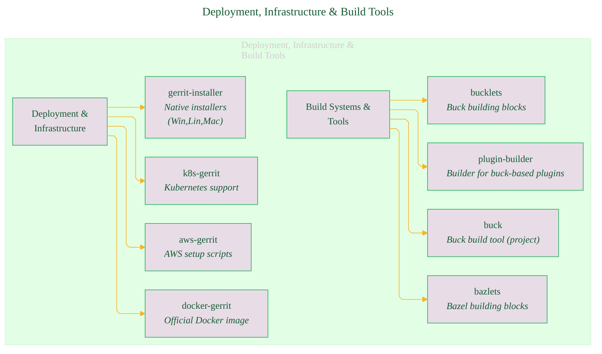

---

## 7. Tooling, CI/CD, Community & Other Projects

This diagram covers remaining categories like specialized tools, CI/CD infrastructure, documentation, and community outreach projects.

```mermaid
---
title: "Tooling, CI/CD, Community & Other Projects"
author: "Cong Le"
version: "1.0"
license(s): "MIT, CC BY 4.0"
copyright: "Copyright (c) 2025 Cong Le. All Rights Reserved."
config:
  layout: elk
  theme: base
---
%%%%%%%% Mermaid version v11.4.1-b.14
%%%%%%%% Available curve styles include the following keywords:
%% basis, bumpX, bumpY, cardinal, catmullRom, linear, monotoneX, monotoneY, natural, step, stepAfter, stepBefore.
%%{
  init: {
    'securityLevel': 'loose',
    'flowchart': { 'htmlLabels': true, 'curve': 'linear' },
    'fontFamily': 'Monaco',
    'themeVariables': {
      'primaryColor': '#F5E3',
      'primaryTextColor': '#145A32',
      'lineColor': '#F8B229',
      'primaryBorderColor': '#27AE60',
      'secondaryColor': '#EBDEF0',
      'secondaryTextColor': '#6C3483',
      'secondaryBorderColor': '#A569BD',
      'fontSize': '15px'
    }
  }
}%%
flowchart TD
    subgraph OtherProjects["Tooling, CI/CD, Community &<br/> Other"]
    direction LR
        ToolingLib["Core Tooling &<br/> Libraries"]
            ToolingLib --> TL_ExecWar["executablewar<br/><i>Run code from WARs</i>"]
             click TL_ExecWar href "https://gerrit.googlesource.com/executablewar" "executablewar"
            ToolingLib --> TL_GCE["gcompute-tools<br/><i>Google Compute Engine tools</i>"]
             click TL_GCE href "https://gerrit.googlesource.com/gcompute-tools" "gcompute-tools"
            ToolingLib --> TL_Gitiles["gitiles<br/><i>Git repository browser</i>"]
             click TL_Gitiles href "https://gerrit.googlesource.com/gitiles" "gitiles"
            ToolingLib --> TL_Repo["git-repo<br/><i>Multiple Git Repository Tool</i>"]
             click TL_Repo href "https://gerrit.googlesource.com/git-repo" "git-repo"
            ToolingLib --> TL_RepoHooks["git-repohooks<br/><i>Repo reference hooks</i>"]
             click TL_RepoHooks href "https://gerrit.googlesource.com/git-repohooks" "git-repohooks"
            ToolingLib --> TL_GSWagon["gs-maven-wagon<br/><i>Maven wagon for Google Storage</i>"]
             click TL_GSWagon href "https://gerrit.googlesource.com/gs-maven-wagon" "gs-maven-wagon"
            ToolingLib --> TL_GwtOrm["gwtorm<br/><i>Tiny ORM</i>"]
             click TL_GwtOrm href "https://gerrit.googlesource.com/gwtorm" "gwtorm"
            ToolingLib --> TL_JavaPrettify["java-prettify<br/><i>Java port of Google Prettify</i>"]
             click TL_JavaPrettify href "https://gerrit.googlesource.com/java-prettify" "java-prettify"
            ToolingLib --> TL_JGit["jgit<br/><i>Core Java Git implementation</i>"]
             click TL_JGit href "https://gerrit.googlesource.com/jgit" "jgit"
            ToolingLib --> TL_PrologCafe["prolog-cafe<br/><i>Prolog-to-Java translator</i>"]
             click TL_PrologCafe href "https://gerrit.googlesource.com/prolog-cafe" "prolog-cafe"
            ToolingLib --> TL_PolyBridges["polymer-bridges"]
             click TL_PolyBridges href "https://gerrit.googlesource.com/polymer-bridges" "polymer-bridges"
            ToolingLib --> TL_GitFS["gitfs<br/><i>FUSE for Android checkouts</i>"]
             click TL_GitFS href "https://gerrit.googlesource.com/gitfs" "gitfs"
            ToolingLib --> TL_Gitblit["gitblit<br/><i>Fork of Gitblit project</i>"]
             click TL_Gitblit href "https://gerrit.googlesource.com/gitblit" "gitblit"
            ToolingLib --> TL_ZKRefDB["zookeeper-refdb<br/><i>ZooKeeper powered Git storage</i>"]
             click TL_ZKRefDB href "https://gerrit.googlesource.com/zookeeper-refdb" "zookeeper-refdb"
            ToolingLib --> TL_Zoekt["zoekt<br/><i>Code search (Archived)</i>"]
             click TL_Zoekt href "https://gerrit.googlesource.com/zoekt" "zoekt"
            ToolingLib --> TL_GwtExpUI["gwtexpui<br/><i>GWT UI Tools (Deprecated, Merged)</i>"]
             click TL_GwtExpUI href "https://gerrit.googlesource.com/gwtexpui" "gwtexpui"

        CICDInfra["CI/CD Infrastructure<br/>(Non-Plugin)"]
        direction LR
            CICDInfra --> CI_Scripts["gerrit-ci-scripts<br/><i>Gerrit CI build scripts</i>"]
             click CI_Scripts href "https://gerrit.googlesource.com/gerrit-ci-scripts" "gerrit-ci-scripts"
            CICDInfra --> CI_LuciConf["luci-config<br/><i>Gerrit LUCI CI config</i>"]
             click CI_LuciConf href "https://gerrit.googlesource.com/luci-config" "luci-config"
            CICDInfra --> CI_LuciTest["luci-test<br/><i>LUCI test repo</i>"]
             click CI_LuciTest href "https://gerrit.googlesource.com/luci-test" "luci-test"
            CICDInfra --> CI_ZuulConf["zuul/config<br/><i>Zuul config repo</i>"]
             click CI_ZuulConf href "https://gerrit.googlesource.com/zuul/config" "zuul/config"
            CICDInfra --> CI_ZuulJobs["zuul/jobs<br/><i>Zuul jobs repo</i>"]
             click CI_ZuulJobs href "https://gerrit.googlesource.com/zuul/jobs" "zuul/jobs"
            CICDInfra --> CI_ZuulOps["zuul/ops<br/><i>Zuul ops repo</i>"]
             click CI_ZuulOps href "https://gerrit.googlesource.com/zuul/ops" "zuul/ops"

        DocsCommunity["Documentation &<br/> Community"]
        direction LR
            DocsCommunity --> DC_Homepage["homepage<br/><i>Gerrit homepage source</i>"]
             click DC_Homepage href "https://gerrit.googlesource.com/homepage" "homepage"
            DocsCommunity --> DC_HomepageTest["homepage-test<br/><i>Test area for homepage</i>"]
             click DC_HomepageTest href "https://gerrit.googlesource.com/homepage-test" "homepage-test"
            DocsCommunity --> Summits["Summits"]
                Summits --> S_2015("summit/2015")
                 click S_2015 href "https://gerrit.googlesource.com/summit/2015" "summit/2015"
                Summits --> S_2016("summit/2016")
                 click S_2016 href "https://gerrit.googlesource.com/summit/2016" "summit/2016"
                Summits --> S_2017("summit/2017")
                 click S_2017 href "https://gerrit.googlesource.com/summit/2017" "summit/2017"
                Summits --> S_2018("summit/2018")
                 click S_2018 href "https://gerrit.googlesource.com/summit/2018" "summit/2018"
                Summits --> S_2019("summit/2019")
                 click S_2019 href "https://gerrit.googlesource.com/summit/2019" "summit/2019"
                Summits --> S_2021("summit/2021")
                 click S_2021 href "https://gerrit.googlesource.com/summit/2021" "summit/2021"
                Summits --> S_2022("summit/2022")
                 click S_2022 href "https://gerrit.googlesource.com/summit/2022" "summit/2022"
                Summits --> S_2023("summit/2023")
                 click S_2023 href "https://gerrit.googlesource.com/summit/2023" "summit/2023"
                Summits --> S_2024("summit/2024")
                 click S_2024 href "https://gerrit.googlesource.com/summit/2024" "summit/2024"
                Summits --> S_2025("summit/2025")
                 click S_2025 href "https://gerrit.googlesource.com/summit/2025" "summit/2025"
            DocsCommunity --> Training["Training Materials"]
                Training --> TR_Gerrit["training/gerrit<br/><i>Gerrit training material</i>"]
                 click TR_Gerrit href "https://gerrit.googlesource.com/training/gerrit" "training/gerrit"
                Training --> TR_Sample["training/sample<br/><i>Sample project for workshop</i>"]
                 click TR_Sample href "https://gerrit.googlesource.com/training/sample" "training/sample"


        TestInternal["Test &<br/> Internal Repos"]
        direction LR
            TestInternal --> TI_Brohlfs["brohlfs-test"]
             click TI_Brohlfs href "https://gerrit.googlesource.com/brohlfs-test" "brohlfs-test"
            TestInternal --> TI_Hntu["hntu-test"]
             click TI_Hntu href "https://gerrit.googlesource.com/hntu-test" "hntu-test"
            TestInternal --> TI_TestRepo["TestRepo"]
             click TI_TestRepo href "https://gerrit.googlesource.com/TestRepo" "TestRepo"
            TestInternal --> MiscUtils["Various Utils"]
                MiscUtils --> MU_BugReporter["gerrit-bug-reporter"]
                 click MU_BugReporter href "https://gerrit.googlesource.com/gerrit-bug-reporter" "gerrit-bug-reporter"
                MiscUtils --> MU_FeDevHelper["gerrit-fe-dev-helper"]
                 click MU_FeDevHelper href "https://gerrit.googlesource.com/gerrit-fe-dev-helper" "gerrit-fe-dev-helper"
                MiscUtils --> MU_Linter["gerrit-linter"]
                 click MU_Linter href "https://gerrit.googlesource.com/gerrit-linter" "gerrit-linter"
                MiscUtils --> MU_LoadTests["gerrit-load-tests"]
                 click MU_LoadTests href "https://gerrit.googlesource.com/gerrit-load-tests" "gerrit-load-tests"
                MiscUtils --> MU_Monitoring["gerrit-monitoring"]
                 click MU_Monitoring href "https://gerrit.googlesource.com/gerrit-monitoring" "gerrit-monitoring"
                MiscUtils --> MU_ReleaseTools["gerrit-release-tools"]
                 click MU_ReleaseTools href "https://gerrit.googlesource.com/gerrit-release-tools" "gerrit-release-tools"
                MiscUtils --> MU_Switch["gerrit-switch<br/><i>Chrome ext. GWT/PolyGerrit UI switch</i>"]
                 click MU_Switch href "https://gerrit.googlesource.com/gerrit-switch" "gerrit-switch"
    end

    %%   OtherProjects --> ToolingLib
    %%     OtherProjects --> CICDInfra
    %%     OtherProjects --> DocsCommunity
    %%     OtherProjects --> TestInternal

```

---
**Licenses:**

- **MIT License:**   - Full text in [LICENSE](LICENSE) file.
- **Creative Commons Attribution 4.0 International:**  - Legal details in [LICENSE-CC-BY](LICENSE-CC-BY) and at [Creative Commons official site](http://creativecommons.org/licenses/by/4.0/).

---